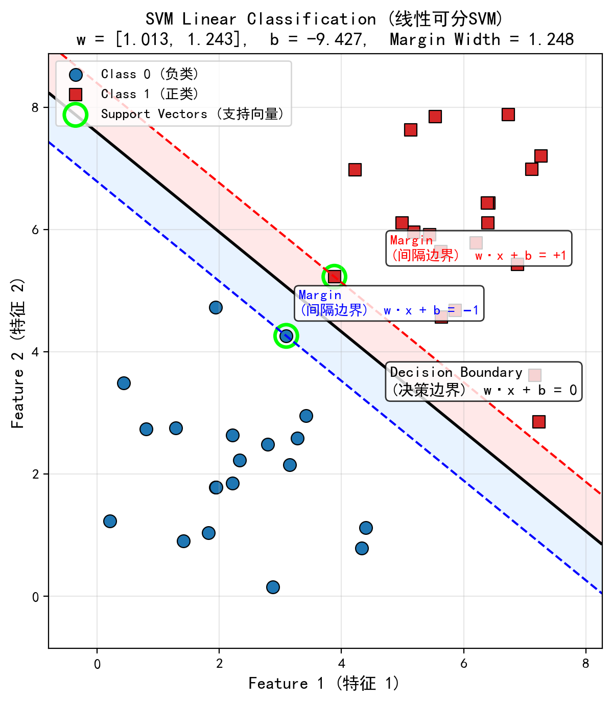
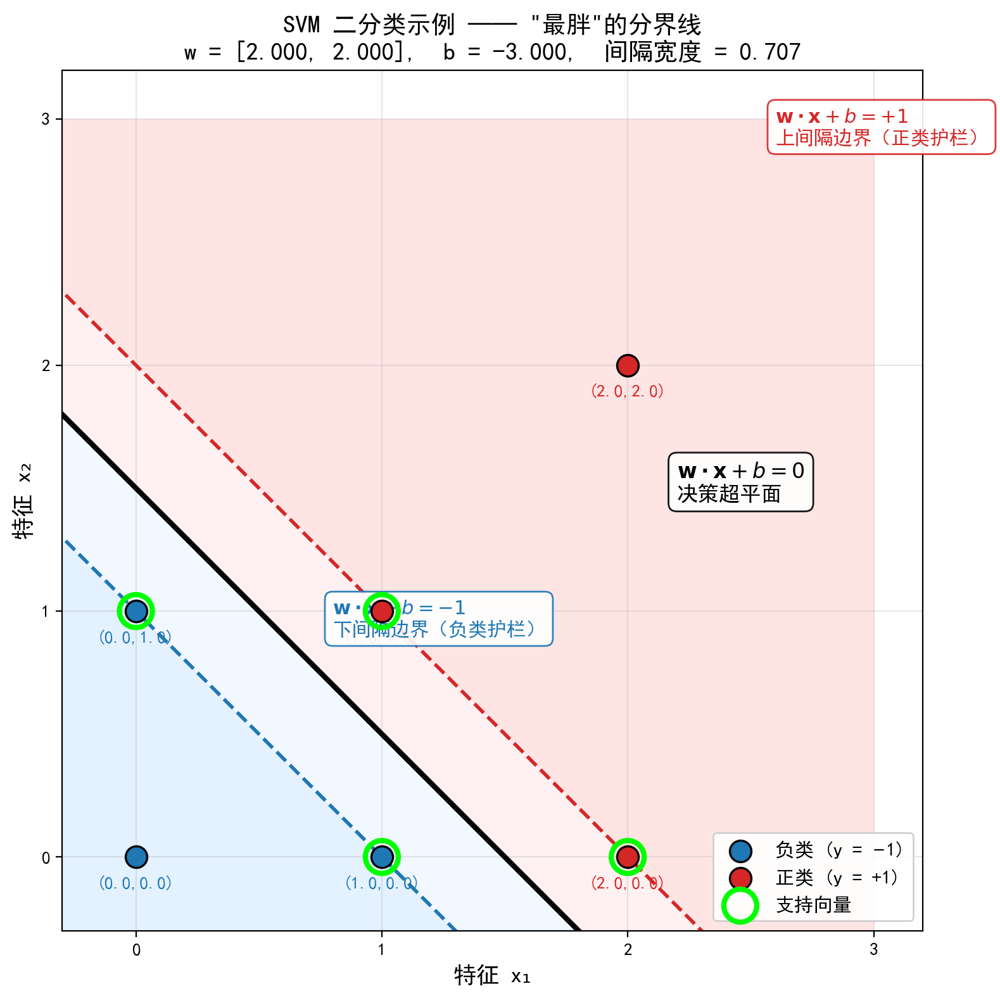
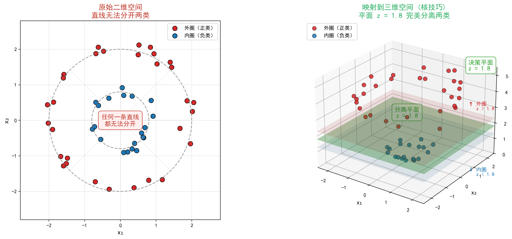
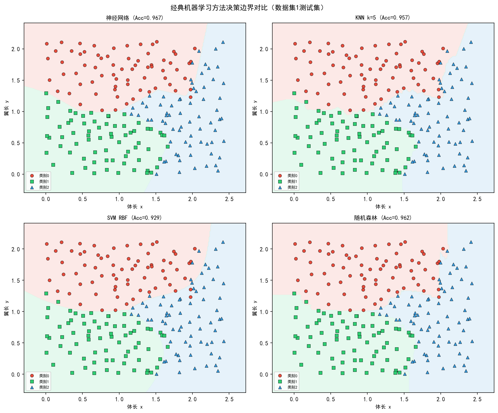

# 从一条线到高维空间：彻底搞懂支持向量机（SVM）

## 先从一个简单的分类问题说起

假设你有一堆邮件，想区分"正常邮件"和"垃圾邮件"。这就是典型的二分类问题：给每个邮件提取一些特征（比如单词频率、发件人等等），然后让算法学习一个决策边界。

在二维平面中，分类问题可以想象成平面上有两种颜色的点（比如红点和蓝点），我们希望画出一条直线，把两类点尽可能分开。问题是：这样的直线可能有很多条，哪一条最好？

想象一下：红点和蓝点之间有无数条直线可以分开它们，但直觉告诉我们——**最中间的那条**最安全，因为它对未知点的容错能力最强。

这就是 SVM 的核心思想：找一个超平面，不仅能把两类分开，而且让离它最近的样本点尽可能远，或者说希望两类是绝对公平的，即到它的最短距离相同。这个"最短距离"称为**间隔**（margin），最大化间隔的超平面就是 SVM 的解。

## 二维直观：一条直线和两条"护栏"

为了把抽象概念具象化，我们看一个二维线性可分的例子。

- 正类样本：$(1,1), (2,2), (2,0)$
- 负类样本：$(0,0), (0,1), (1,0)$

手工模拟可知，存在一条直线 $x + y - 1 = 0$ 大致能分开它们。但 SVM 不会随便画线，它会寻找那根"最公平"的分界线。

实际上，SVM 在图上会画出三条线：

1. **决策超平面**：$\mathbf{w} \cdot \mathbf{x} + b = 0$（中间那条实线）
2. **上间隔边界**：$\mathbf{w} \cdot \mathbf{x} + b = +1$（正类的"护栏"）
3. **下间隔边界**：$\mathbf{w} \cdot \mathbf{x} + b = -1$（负类的"护栏"）

**为什么要画这三条线？**

- **决策超平面**是分类边界，新样本落在哪一侧就判定为哪一类。
- **两条间隔边界**定义了分类间隔（margin）。间隔越宽，模型对样本的微小扰动就越不敏感，泛化能力越强。
- 落在间隔边界上的样本点称为**支持向量**，它们"撑起"了间隔。其他样本不影响最终超平面的位置，这体现了SVM的稀疏性。

因此，画出三条线能直观展示SVM的核心思想：在正确分类的前提下，寻找使间隔最大化的决策超平面。这也是SVM与普通线性分类器（如感知机）的关键区别。

## 从几何直觉到数学规划：硬间隔 SVM

给定训练集 $D = \{(\mathbf{x}_i, y_i)\}_{i=1}^n$，其中 $y_i \in \{-1, +1\}$。我们想要超平面 $\mathbf{w} \cdot \mathbf{x} + b = 0$ 满足：

$$y_i (\mathbf{w} \cdot \mathbf{x}_i + b) > 0 \quad (\text{正确分类})$$

但仅此不够，我们还要最大化间隔。样本点到超平面的几何间隔为 $\frac{|\mathbf{w} \cdot \mathbf{x}_i + b|}{\|\mathbf{w}\|}$。为了简化，可以固定函数间隔为 1（通过缩放 $\mathbf{w}, b$），即要求：

$$y_i (\mathbf{w} \cdot \mathbf{x}_i + b) \ge 1$$

此时几何间隔就等于 $1/\|\mathbf{w}\|$。最大化间隔等价于最小化 $\|\mathbf{w}\|^2$，于是我们得到 SVM 的原始优化问题：

$$\min_{\mathbf{w}, b} \frac{1}{2}\|\mathbf{w}\|^2 \quad \text{s.t.} \quad y_i(\mathbf{w} \cdot \mathbf{x}_i + b) \ge 1,\ i=1,\dots,n$$

这是一个凸二次规划（QP），有唯一全局最优解。

## 如果数据不是线性可分的？——软间隔的引入

现实数据往往含有噪声或本身就不是线性可分的。如果强制要求所有样本满足 $y_i(\mathbf{w}\cdot\mathbf{x}_i+b)\ge 1$，可能找不到可行解，或者模型过拟合。

于是我们允许部分样本"犯错"，引入松弛变量 $\xi_i \ge 0$，约束放松为：

$$y_i(\mathbf{w}\cdot\mathbf{x}_i+b) \ge 1 - \xi_i$$

目标函数则需要惩罚那些 $\xi_i > 0$ 的样本，变成：

$$\min_{\mathbf{w}, b, \boldsymbol{\xi}} \frac{1}{2}\|\mathbf{w}\|^2 + C \sum_{i=1}^n \xi_i$$

其中 $C>0$ 是惩罚参数，控制"间隔宽度"与"误分类代价"之间的平衡。$C$ 越大，模型对误分类越敏感，倾向于更小的间隔（更复杂的边界）；$C$ 越小，允许更多错误，但间隔更宽（更平滑）。这就是软间隔 SVM。

## 如果数据根本就不是线性的？——升维与核技巧

有些数据在原始空间里无论怎么画直线都分不开，比如二维平面上一圈红点包围一圈蓝点。但如果我们把数据映射到三维空间（比如增加一个 $z = x^2 + y^2$ 的维度），那么红点和蓝点就可能被一个平面分开！

这就是升维的思想：通过一个映射 $\phi: \mathbb{R}^d \to \mathcal{H}$，将原始特征投影到高维（甚至无穷维）希尔伯特空间，然后在高维空间中构造线性 SVM。

然而直接计算 $\phi(\mathbf{x})$ 可能非常昂贵。核技巧（Kernel Trick）让我们绕过显式计算，直接用原空间中的核函数 $\kappa(\mathbf{x}_i, \mathbf{x}_j)$ 代表高维内积 $\phi(\mathbf{x}_i) \cdot \phi(\mathbf{x}_j)$。

### RBF 核的显式表达推导

最常用的核函数是高斯径向基核（RBF）：

$$\kappa_{\text{RBF}}(\mathbf{x}, \mathbf{z}) = \exp\left(-\gamma \|\mathbf{x} - \mathbf{z}\|^2\right),\quad \gamma > 0$$

它为什么有效？我们可以通过泰勒级数展开看出它对应的特征映射是无穷维的：

$$\exp(-\gamma \|\mathbf{x}-\mathbf{z}\|^2) = e^{-\gamma \|\mathbf{x}\|^2} e^{-\gamma \|\mathbf{z}\|^2} \sum_{n=0}^{\infty} \frac{(2\gamma)^n}{n!} (\mathbf{x}^T \mathbf{z})^n$$

而 $(\mathbf{x}^T \mathbf{z})^n$ 又可以展开为所有 $n$ 阶单项式的和。这意味着 RBF 核等价于将原特征映射到所有阶单项式张成的无穷维空间，然后计算内积。所以 RBF 核具有强大的拟合能力，但需要小心过拟合（通过调节 $\gamma$ 控制）。

## 对偶问题：为什么要转一道弯？

直接求解原始 QP 比较麻烦，而且我们想引入核技巧、看清楚支持向量的稀疏性。所以 SVM 通常求解其对偶问题。

构造拉格朗日函数（硬间隔情况）：

$$L(\mathbf{w}, b, \boldsymbol{\alpha}) = \frac{1}{2}\|\mathbf{w}\|^2 - \sum_{i=1}^n \alpha_i \big[y_i(\mathbf{w}\cdot\mathbf{x}_i + b) - 1\big], \quad \alpha_i \ge 0$$

令 $\frac{\partial L}{\partial \mathbf{w}}=0$ 得 $\mathbf{w} = \sum_i \alpha_i y_i \mathbf{x}_i$；令 $\frac{\partial L}{\partial b}=0$ 得 $\sum_i \alpha_i y_i = 0$。代入消去 $\mathbf{w}, b$，得到对偶问题：

$$\max_{\boldsymbol{\alpha}} \sum_{i=1}^n \alpha_i - \frac{1}{2} \sum_{i=1}^n \sum_{j=1}^n \alpha_i \alpha_j y_i y_j (\mathbf{x}_i \cdot \mathbf{x}_j)$$

约束：$\alpha_i \ge 0$，$\sum_i \alpha_i y_i = 0$。

对于软间隔 SVM，只需增加上界 $\alpha_i \le C$，即 $0 \le \alpha_i \le C$。

对偶问题的好处：

- 目标函数只涉及样本内积，可以替换为核函数 $\kappa(\mathbf{x}_i, \mathbf{x}_j)$，自动实现升维。
- 解 $\boldsymbol{\alpha}^*$ 具有稀疏性：只有支持向量对应的 $\alpha_i^* > 0$，其余为 0。
- 可以应用高效的 SMO 算法。

## 决策函数：预测新样本

求解对偶问题得到 $\alpha_i^*$ 后，我们并不需要显式的 $\mathbf{w}^*$，因为决策函数可以直接写为：

$$f(\mathbf{x}) = \operatorname{sign}\left( \sum_{i=1}^n \alpha_i^* y_i \kappa(\mathbf{x}_i, \mathbf{x}) + b^* \right)$$

其中偏置 $b^*$ 可以通过任何一个支持向量（$0<\alpha_i^*<C$）计算：

$$b^* = y_i - \sum_{j=1}^n \alpha_j^* y_j \kappa(\mathbf{x}_j, \mathbf{x}_i)$$

由于只有支持向量对应的 $\alpha_i^*>0$，求和实际上只对少数样本进行，预测速度很快。

## 解对偶问题的利器：SMO 算法详解

当样本量很大时，直接求解二次规划不现实。1998 年 John Platt 提出的 **SMO（序列最小优化）** 算法，将大型 QP 分解为一系列最小的两变量子问题，每个子问题可以解析求解。

### SMO 的核心思想

- 每次只选择两个拉格朗日乘子 $\alpha_i$ 和 $\alpha_j$ 优化，固定其余 $n-2$ 个。
- 因为等式约束 $\sum \alpha_i y_i = 0$，两个变量可以通过线性关系互相表示，因此子问题只有一维搜索，可以直接推导出解析解。
- 通过启发式策略选择"最违反 KKT 条件"的乘子对，保证快速收敛。

### 两变量子问题的解析公式

假设我们选定 $\alpha_1$ 和 $\alpha_2$ 进行优化，固定 $\alpha_3,\dots,\alpha_n$。由约束：

$$\alpha_1 y_1 + \alpha_2 y_2 = -\sum_{i=3}^n \alpha_i y_i = \zeta \quad (\text{常数})$$

定义预测误差 $E_i = g(\mathbf{x}_i) - y_i$，其中 $g(\mathbf{x}_i) = \sum_{j=1}^n \alpha_j y_j \kappa(\mathbf{x}_i, \mathbf{x}_j) + b$。

可以推导出 $\alpha_2$ 的未裁剪更新公式：

$$\alpha_2^{\text{new, unclipped}} = \alpha_2^{\text{old}} + \frac{y_2 (E_1 - E_2)}{\eta}$$

其中 $\eta = \kappa_{11} + \kappa_{22} - 2\kappa_{12}$，$\kappa_{ij}=\kappa(\mathbf{x}_i, \mathbf{x}_j)$。

然后根据上下界 $L, H$ 裁剪，边界取决于 $y_1, y_2$ 以及软间隔参数 $C$：

- 若 $y_1 \neq y_2$：$L = \max(0, \alpha_2^{\text{old}} - \alpha_1^{\text{old}})$，$H = \min(C, C + \alpha_2^{\text{old}} - \alpha_1^{\text{old}})$
- 若 $y_1 = y_2$：$L = \max(0, \alpha_2^{\text{old}} + \alpha_1^{\text{old}} - C)$，$H = \min(C, \alpha_2^{\text{old}} + \alpha_1^{\text{old}})$

更新完 $\alpha_2$ 后，利用线性关系更新 $\alpha_1$：

$$\alpha_1^{\text{new}} = \alpha_1^{\text{old}} + y_1 y_2 (\alpha_2^{\text{old}} - \alpha_2^{\text{new}})$$

### 更新阈值 $b$ 和误差缓存

更新完 $\alpha_1, \alpha_2$ 后，需要重新计算 $b$ 以保持 KKT 条件。最终取满足条件的 $b$ 值（或平均值），然后更新所有样本的误差 $E_i$。

### 启发式选择策略

1. **外层循环**：遍历所有样本，找出第一个违反 KKT 条件的乘子 $\alpha_1$。
2. **内层循环**：对选定的 $\alpha_1$，选择 $\alpha_2$ 使得 $|E_1 - E_2|$ 最大，因为这样能最大化更新步长。

重复上述过程直到所有乘子满足 KKT 条件（允许一个小容差，如 $10^{-3}$），或者达到最大迭代次数。

## 多分类：SVM 如何应对多个类别？

SVM 本质上是二分类器。处理多分类通常有两种策略：

- **一对多（OvR）**：为每个类别训练一个 SVM，将该类视为正类，其余所有类别视为负类。预测时取决策函数输出值最大的类别。
- **一对一（OvO）**：每两个类别之间训练一个 SVM，共 $\frac{k(k-1)}{2}$ 个分类器。预测时用所有分类器投票，得票最多的类别胜出。

实际库（如 scikit-learn）默认采用 OvR，因为训练的分类器数量少，效率更高。

## 总结

我们从一根直观的"最宽分界线"出发，逐步揭开了 SVM 的数学面纱：

- **硬间隔 SVM** 是一个凸二次规划，目标是最小化 $\|\mathbf{w}\|^2$，约束所有样本被正确分类且离超平面至少距离 1。
- **软间隔**引入松弛变量 $\xi_i$ 和惩罚参数 $C$，允许少量噪声样本，提升泛化性。
- **核技巧**（特别是 RBF 核）将数据隐式映射到高维空间，使线性 SVM 能够处理非线性问题，其无穷维特征源于泰勒展开。
- **对偶问题**将 $\mathbf{w}$ 表达为样本的线性组合，使核函数和内积替换成为可能，并揭示支持向量的稀疏性。
- **SMO 算法**通过解析求解两变量子问题，高效地训练大规模 SVM，其启发式选择保证了收敛速度。

SVM 的理论非常优美，但它也并非万能：在大数据（百万级以上）或深度学习盛行的今天，SVM 的训练速度可能不如神经网络快。然而，在中小规模数据集、特征维度较高、以及需要解释性较强的场景下，SVM 仍然是值得首选的强大工具。希望本文能帮助你真正理解 SVM 的精髓，并能在实际项目中灵活运用它。
